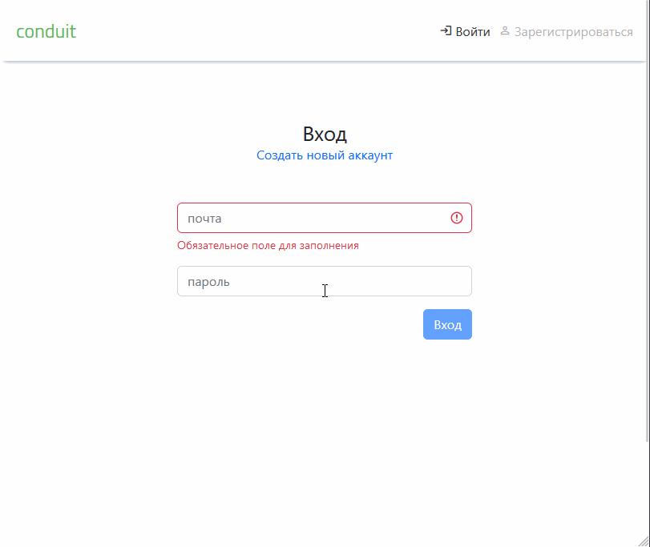

<h2>Blog Vue</h2>

:point_right: [<b>демонстрация</b>](https://yarncra.github.io/blog)

<pre>
- Vue: 
    - Для HTTP-запросов - axios (CRUD)
    - Валидация форм - vuelidate
    - Пагинация - vuejs-paginate
    - Роутинг - vue-router 
    - Иконки - material-design-icons-iconfont
    - Управление состоянием через vuex
- SCSS
- БЭМ (опционально), bootstrap
- Адаптивная верстка</pre>
<pre></pre>
